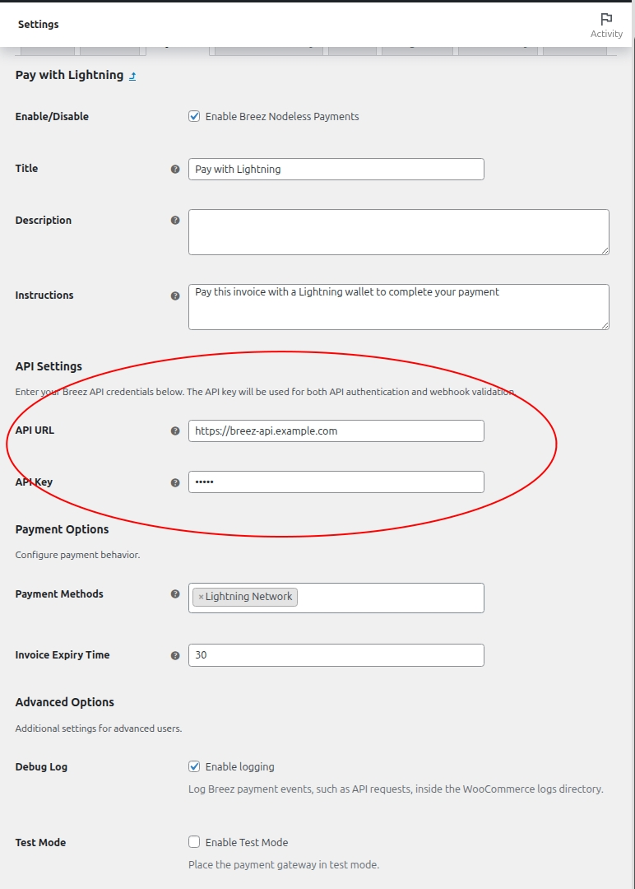

# Lightning Payments for WooCommerce
Lightning Payments for WooCommerce is a simple Woocommerce extension that enables Lightning network payments for WooCommerce stores using the Breez Nodeless SDK via [payments-rest-api](https://github.com/breez/payments-rest-api).

## Features
- Accept Lightning network payments
- Seamless integration with WooCommerce checkout
- Easy configuration from the WooCommerce admin panel

## Installation
1. Download or clone this repository to your local machine.
2. Copy the `breez-woocommerce` folder to your WordPress `wp-content/plugins/` directory.
3. In your WordPress admin dashboard, go to **Plugins** and activate **Breez WooCommerce**.
4. Go to **WooCommerce > Settings > Payments** and enable the Breez payment gateway.
5. Go to **WooCommerce > Settings > Payments** and click **Manage** at **Pay with Lightning**. Enter the url and api key you configured when deploying [payments-rest-api](https://github.com/breez/payments-rest-api)

   

## Requirements
- WordPress 5.0 or higher
- WooCommerce 4.0 or higher
- PHP 7.2 or higher

## REST api

The WooCommerce plugin requires a separate REST API service to handle Lightning payments - a deployment of [payments-rest-api](https://github.com/breez/payments-rest-api). You can easily deploy it to fly.io free tier, just follow documentation in [deployment options for payments-rest-api](https://github.com/breez/payments-rest-api/tree/main?tab=readme-ov-file#deployment-options).
